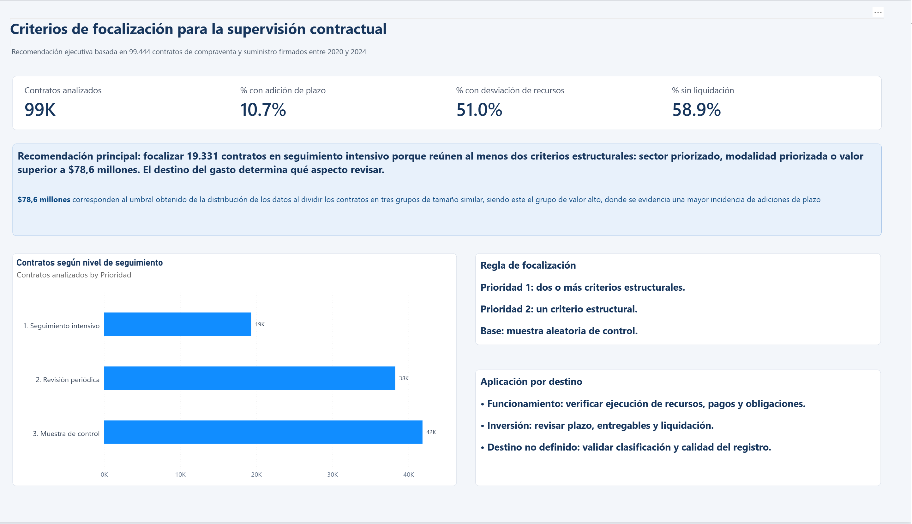
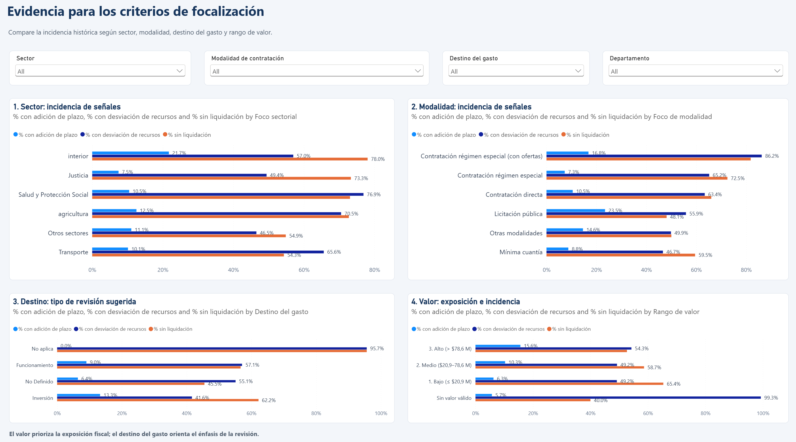
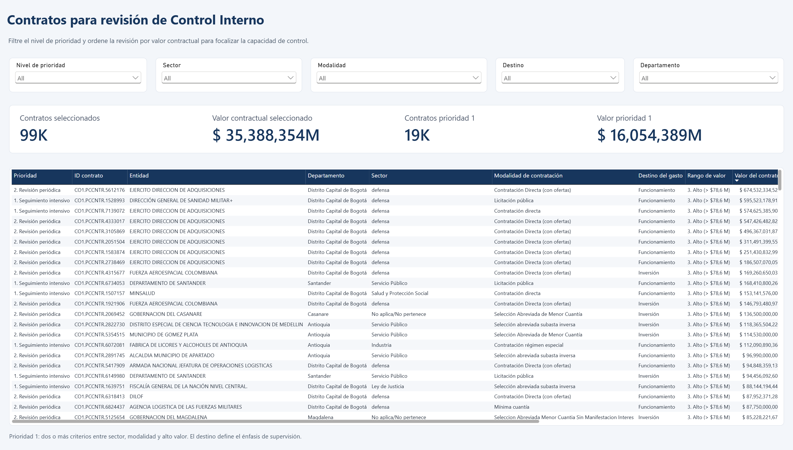

# ciencia-de-datos-aplicada-taller-1

## **Integrantes:**
| Nombre | Código |
|---|---|
| Juan David Guzmán | 201224442 |
| Andrés Felipe Méndez | 200611694 |


## **Objetivo**

Analizar el comportamiento histórico de los contratos de compraventa y suministro registrados en el conjunto de datos, con el propósito de identificar patrones que permitan establecer algunas recomendaciones para la supervisión de los contratos públicos. A partir de estos resultados, se busca proponer a la Oficina de Control Interno un conjunto de criterios de focalización que permita priorizar los contratos que pueden requerir mayor seguimiento, considerando e identificando los atributos más relevantes aplicables.

Proveer al equipo de Control Interno un reporte con la opción de analizar las variables que se resaltan en el análisis, para estudiar comportamientos pasados y así apoyar las decisiones sobre la supervisión de nuevos contratos.

## **Alcance**

Inicialmente, el análisis del presente ejercicio se basa en el set de datos disponible de los contratos de compraventa en el periodo descrito, sin un procesamiento de calidad previo identificado y sin insumos o reglas adicionales de negocio.

Se establecerán algunos supuestos o premisas que ayuden a limitar o aclarar el ejercicio, cuando sea necesario, para dar solución a cualquier estado donde esto ayude al desarrollo del ejercicio.

## **Conclusiones (Insights)**

Los resultados recomiendan adoptar una supervisión diferenciada y basada en riesgo. Los contratos de régimen especial con ofertas deberían priorizarse para verificar la ejecución de recursos y el cierre contractual, especialmente en los sectores Salud, Educación Nacional, Interior y Ciencia Tecnología. Las licitaciones públicas requieren mayor seguimiento de cronogramas y adiciones de plazo. Por su parte, los contratos de mínima cuantía, debido a su elevado volumen, deberían controlarse mediante alertas automatizadas y muestras periódicas. Estas cifras representan señales para orientar la supervisión y no constituyen, por sí mismas, evidencia de irregularidades.

- La modalidad de contratación permite identificar diferentes necesidades de supervisión. Los contratos de régimen especial con ofertas presentan una alta incidencia de señales relacionadas con recursos y liquidación, mientras que las licitaciones públicas requieren mayor atención sobre el cumplimiento de cronogramas y las adiciones de plazo. En el caso de la mínima cuantía, aunque las tasas son cercanas o inferiores al comportamiento general, su elevado volumen hace recomendable implementar alertas automatizadas y revisiones por muestreo.

- El sector también representa un criterio relevante. Salud concentra el mayor número de contratos con señales de riesgo, mientras que sectores como Interior y Ciencia Tecnología presentan tasas elevadas en algunas combinaciones de con la modalidad. Por esta razón, la focalización debe considerar conjuntamente ambos factores y evitar decisiones sustentadas exclusivamente en uno de ellos.

- El destino del gasto permite definir el énfasis de la supervisión. En los contratos de funcionamiento resulta conveniente revisar la ejecución de recursos, los pagos y el cumplimiento de obligaciones. En los contratos de inversión debe darse mayor atención al plazo, los entregables y la liquidación. Cuando el destino no se encuentra definido, se recomienda verificar la calidad y correcta clasificación del registro.

- Los contratos de valor alto presentan una mayor incidencia de adiciones de plazo y representan una exposición fiscal superior. Sin embargo, el valor no debe utilizarse de manera aislada como indicador de riesgo, sino como un criterio adicional para priorizar la revisión de contratos que también presentan condiciones asociadas con el sector o la modalidad.

- Como resultado, se recomienda aplicar un esquema de focalización por niveles: seguimiento intensivo para los contratos que reúnen al menos dos criterios estructurales; revisión periódica para aquellos que presentan un criterio; y muestras aleatorias de control para los demás contratos.

## **Organización del repositorio**

El repositorio está organizado de manera que separa los datos de entrada, el análisis desarrollado en Python y el informe ejecutivo construido en Power BI.

```text
ciencia-de-datos-aplicada-taller-1/
├── data/
│   └── secop_bienes.parquet
├── Informe_Control_Interno_completo/
│   ├── Informe_Control_Interno.Report/
│   ├── Informe_Control_Interno.SemanticModel/
│   ├── .gitignore
│   └── Informe_Control_Interno.pbip
├── .gitignore
├── README.md
├── enunciado.pdf
├── notebook.ipynb
└── requirements.txt
```

### Descripción de los componentes

- **`data/`**: contiene los datos utilizados para desarrollar el análisis.

  - **`secop_bienes.parquet`**: conjunto de datos de contratos empleado como fuente principal del ejercicio.

- **`notebook.ipynb`**: contiene el procesamiento, exploración, análisis y visualización de los datos, así como la construcción de los criterios de focalización y primeras conclusiones del ejercicio.

- **`Informe_Control_Interno_completo/`**: contiene el proyecto desarrollado en Power BI Desktop, como complemento para los analistas de control interno, para evaluar los criteros sobre los datos históricos.

  - **`Informe_Control_Interno.pbip`**: archivo principal para abrir el proyecto en Power BI Desktop.
  - **`Informe_Control_Interno.Report/`**: contiene la definición de las páginas, visualizaciones, recursos y configuración del informe.
  - **`Informe_Control_Interno.SemanticModel/`**: contiene la definición del modelo semántico utilizado por el informe, incluyendo tablas, relaciones y medidas.
  - **`.gitignore`**: excluye archivos locales o temporales generados por Power BI que no deben almacenarse en el repositorio.

- **`requirements.txt`**: relaciona las librerías de Python necesarias para ejecutar el notebook.

- **`enunciado.pdf`**: contiene el enunciado y los requerimientos originales del ejercicio.

- **`README.md`**: presenta el objetivo, alcance, conclusiones, organización e instrucciones de ejecución del proyecto.

- **`.gitignore`**: define los archivos y carpetas generales que Git no debe incluir en el control de versiones.

## **Instrucciones de ejecución**

El repositorio contiene dos archivos principales de ejecución: el **notebook con el desarrollo completo del análisis** y el **informe ejecutivo en Power BI**, preparado para presentar los principales resultados al equipo de la Oficina de Control Interno.

### 1. Análisis completo en Python

El desarrollo integral del ejercicio se encuentra en el archivo:

```text
notebook.ipynb
```

Este notebook contiene la preparación y exploración de los datos, los análisis realizados, las visualizaciones, la definición de los criterios de focalización y las primeras conclusiones obtenidas del análisis.

Para ejecutarlo:

1. Abrir el repositorio en Visual Studio Code o Jupyter Notebook.
2. Instalar las librerías requeridas, incluidas en el archivo requirements.txt:

   ```bash
   pip install -r requirements.txt
   ```

3. Abrir el archivo `notebook.ipynb`.
4. Seleccionar el entorno de Python correspondiente.
5. Ejecutar las celdas en el orden establecido o utilizar la opción **Run All**.

Los datos utilizados se encuentran en:

```text
data/secop_bienes.parquet
```

### 2. Informe ejecutivo en Power BI

El informe que responde al último punto del taller se encuentra en el proyecto de Power BI:

```text
Informe_Control_Interno_completo/Informe_Control_Interno.pbip
```

Para consultarlo:

1. Tener instalado **Power BI Desktop** (Disponible gratuitamente en la Microsoft Store de Windows).
2. Abrir el archivo `Informe_Control_Interno.pbip`.
3. Esperar a que Power BI cargue el modelo semántico y las visualizaciones.
   - El reporte ya se encuentra apuntando a la fuente de datos del repositorio de GitHub de este taller. No debería requerirse más que una actualización de las fuentes al abrir el archivo.
   - Este reporte incluye los hallazgos más relevantes y las relaciones identificadas en el análisis, para que un analista pueda evaluar los históricos y confirmar los comportamientos expuestos.
4. Navegar por las páginas del informe para consultar el resumen ejecutivo, los criterios de focalización y los contratos priorizados.

El informe fue diseñado para presentar los resultados de una manera clara, visual y orientada a la toma de decisiones. Su propósito es facilitar al equipo de la **Oficina de Control Interno** la comprensión de los principales hallazgos y de los criterios propuestos para orientar la supervisión de los contratos.

> **Nota:** el notebook proporciona la trazabilidad técnica y analítica completa del ejercicio, mientras que el informe de Power BI presenta una síntesis ejecutiva de los resultados. Ambos entregables deben interpretarse de manera complementaria.

> **Recomendación técnica:** para evitar inconvenientes con la longitud de las rutas en Windows y Power BI, se recomienda clonar o copiar el repositorio en una ubicación corta, por ejemplo: `C:\Repos\ciencia-de-datos-aplicada-taller-1`.

### Capturas del informe para Control Interno

Se adjuntan capturas del reporte resultado que puede apoyar la presentación a los directivos y que puede ser usado por el equipo de control Interno, relacionando las variables identificadas en el ejercicio:

1. Resumen ejecutivo


2. Criterios de focalización


3. Contratos priorizados
